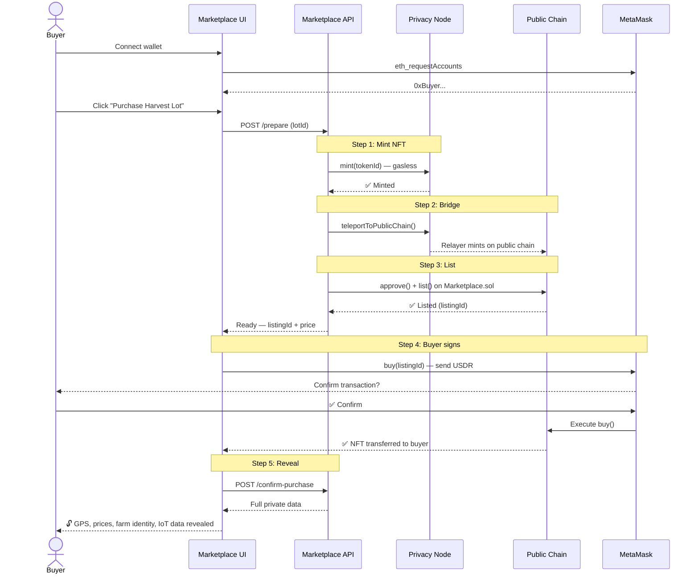

# 🏪 Cocoa Ledger — Marketplace

**The buyer-facing marketplace for verified cacao lots — purchase NFTs, reveal private provenance data.**

> Part of the [Cocoa Ledger](https://github.com/JulioMCruz/Cocoa-Ledger) ecosystem. This repo handles App 3: the NFT Marketplace where verified cacao lots are listed, purchased, and private data is revealed to buyers.

---

## 🏆 Built for EthCC 26 — Rayls Hackathon #2

**Challenge:** Confidential NFT Reveal

**Main Repo:** [github.com/JulioMCruz/Cocoa-Ledger](https://github.com/JulioMCruz/Cocoa-Ledger)

---

## 🔗 How It Fits in the Ecosystem

```
App 1 — Farmer Dashboard          App 2 — Cocoa Agent          App 3 — This Repo
(JulioMCruz/Cocoa-Ledger)        (JulioMCruz/Cocoa-Ledger)    (cocoaledger-hackathon)
┌─────────────────────┐          ┌──────────────────┐          ┌──────────────────────┐
│ 🌡️ IoT sensor data   │          │ 🤖 AI analysis     │          │ 🏪 NFT Marketplace     │
│ stored on Privacy   │──────▶│ reads on-chain    │──────▶│ lists verified lots  │
│ Node (gasless)      │          │ scores quality    │  POST  │ buyer connects wallet│
│                     │          │ fetches prices    │  /api/ │ signs buy() on-chain │
│ Wallet: RainbowKit  │          │ Gemini 2.5 AI     │  cacao │ NFT minted + bridged │
│ 10-1000 readings    │          │ Price Oracle      │ market │ private data revealed│
└─────────────────────┘          └──────────────────┘  /lot   └──────────────────────┘
```

---

## 💡 What This Marketplace Does

1. **Receives** AI-analyzed cacao lots from the Cocoa Agent
2. **Displays** public quality data (grade, score, premium recommendation)
3. **Hides** private data (GPS, farm identity, purchase prices, IoT details)
4. **Enables purchase** — buyer connects MetaMask, signs `buy()` on Marketplace.sol
5. **Mints NFT** on Privacy Node, bridges to Public Chain
6. **Reveals** full provenance data only to the buyer

### Before Purchase vs After Purchase

| Public (visible to everyone) | Private (revealed after purchase) |
|------------------------------|-----------------------------------|
| Quality Grade (S/A/B/C/D) | Farm GPS coordinates |
| Quality Score (0-100) | Exact region and municipality |
| Score breakdown (5 factors) | Cooperative / farm name |
| Premium recommendation | Purchase price per kg |
| Average temperature, humidity | Production costs |
| Crop health assessment | Detailed IoT sensor data |
| Number of IoT readings | Lab quality analysis |
| Market valuation | Per-device statistics |
| | Anomaly detection report |
| | Producer recommendations |

---

## 🔄 Purchase Flow — Step by Step



---

## 📊 AI Quality Scoring

Scores are produced by the [Cocoa Agent](https://github.com/JulioMCruz/Cocoa-Ledger/tree/main/agent) using a **5-factor weighted model**:

| Factor | Weight | What It Evaluates |
|--------|--------|-------------------|
| Flavor/Sensory Potential | 30% | Environmental conditions for fine flavor development |
| Processing Readiness | 25% | Soil moisture, light, rainfall patterns |
| IoT Data Quality | 20% | Reading count, sensor consistency, anomaly rate |
| Farm Environment | 15% | Temperature stability, humidity range, pH |
| Disease Risk | 10% | Monilia, escoba de bruja risk indicators |

### Grades

| Grade | Score | Price Premium |
|-------|-------|---------------|
| 🏆 S | 95-100 | +35% |
| 🥇 A | 85-94 | +20% |
| 🥈 B | 70-84 | +5% |
| 🥉 C | 50-69 | -10% |
| ⚠️ D | 0-49 | -30% (Rejected) |

---

## 🔧 API Endpoints

All under `/api/cacao-market/`:

| Method | Endpoint | Description |
|--------|----------|-------------|
| `POST` | `/lot` | Register lot (from Agent or web form) |
| `GET` | `/lots` | List all lots with public AI scores |
| `GET` | `/lot/:id` | Get lot (private fields hidden until purchased) |
| `POST` | `/lot/:id/prepare` | Server: mint NFT → bridge → list on Marketplace.sol |
| `POST` | `/lot/:id/confirm-purchase` | After MetaMask buy(): reveal private data |
| `POST` | `/lot/:id/purchase` | Quick purchase (no wallet, for testing) |
| `POST` | `/lot/:id/reveal` | Reveal private data |
| `GET` | `/attestations` | Read attestations from public chain |
| `GET` | `/listings` | Active marketplace listings |

### Agent Integration

The Cocoa Agent sends analysis results directly to the marketplace:

```bash
curl -X POST http://<marketplace>/api/cacao-market/lot \
  -H "Content-Type: application/json" \
  -d '{
    "lotId": 11,
    "farmName": "Finca El Llano",
    "origin": "Arauca, Colombia",
    "publicMetadata": {
      "qualityGrade": "A",
      "qualityScore": 89,
      "scoreBreakdown": { "flavorScore": 92, ... },
      "premiumRecommendation": "20%",
      "originVerified": true,
      ...
    },
    "privateMetadata": {
      "gpsAreaCoverage": "7.08N, 70.76W",
      "priceEstimatePerKg": 5.80,
      "iotDataHash": "0x1fbc52dcb37ec...",
      ...
    }
  }'
```

---

## 📝 Smart Contracts

| Contract | Chain | Address | Purpose |
|----------|-------|---------|---------|
| `CocoaLedgerData.sol` | Privacy (800000) | `0x2EC6...Cb8b09` | Full lifecycle: IoT → Harvest → PostHarvest → Logistics → Sale → Reveal |
| `HackathonNFT.sol` | Privacy (800000) | `0x22AB...D06C` | Cacao lot NFTs (ERC721) |
| `Attestation.sol` | Public (7295799) | `0x0Ee6...E61e` | AI quality attestation registry |
| `Marketplace.sol` | Public (7295799) | `0x1926...82f4` | Escrow marketplace — buy with USDR |

### CocoaLedgerData.sol — Lifecycle States

```
Created → Growing (IoT) → Finalized → AI Validated → Harvested →
PostHarvest → InTransit → Stored → Tokenized → Listed → Sold → Revealed
```

Each state transition generates an on-chain event with immutable timestamp.

---

## 📁 Project Structure

```
cocoaledger-hackathon/
├── src/                              ← Smart Contracts
│   ├── CocoaLedger.sol               ← Full lifecycle tracking (Privacy Node)
│   ├── HackathonNFT.sol              ← Bridgeable ERC721 cacao lot NFTs
│   ├── Attestation.sol               ← AI attestation registry (Public Chain)
│   └── Marketplace.sol               ← Escrow marketplace (Public Chain)
│
├── script/                           ← Foundry deploy scripts
│   ├── DeployCocoaLedger.s.sol       ← Deploy lifecycle contract
│   ├── RegisterLot.s.sol             ← Register lot + sample IoT data
│   ├── DeployNFT.s.sol               ← Deploy NFT contract
│   ├── DeployPublic.s.sol            ← Deploy Attestation on public chain
│   └── DeployMarketplace.s.sol       ← Deploy Marketplace on public chain
│
├── agent/                            ← AI verification agent (scoring prompts)
│   ├── src/cacaoVerifier.ts          ← 5-factor scoring methodology
│   ├── src/llm.ts                    ← Multi-provider LLM (Gemini/OpenRouter)
│   └── src/index.ts                  ← Agent entry point
│
├── app/                              ← Marketplace web app
│   ├── server.js                     ← Express API (endpoints + on-chain ops)
│   └── public/index.html             ← Marketplace UI (wallet connect + purchase)
│
└── demo.sh                           ← Terminal demo script
```

---

## 🚀 Quick Start

### Prerequisites
- [Foundry](https://book.getfoundry.sh/getting-started/installation) (`forge`, `cast`)
- [Node.js](https://nodejs.org/) 18+
- MetaMask with Rayls Testnet

### Setup

```bash
git clone https://github.com/davidrodr1guez/cocoaledger-hackathon.git
cd cocoaledger-hackathon
forge install && npm install
cp .env.example .env  # Fill with credentials
source .env
```

### Deploy Contracts

```bash
# Privacy Node (gasless)
forge script script/DeployCocoaLedger.s.sol --rpc-url $PRIVACY_NODE_RPC_URL --broadcast --legacy
forge script script/DeployNFT.s.sol --rpc-url $PRIVACY_NODE_RPC_URL --broadcast --legacy

# Public Chain (needs USDR)
DEPLOYER_PRIVATE_KEY=$PUBLIC_CHAIN_PRIVATE_KEY forge script script/DeployPublic.s.sol --rpc-url $PUBLIC_CHAIN_RPC_URL --broadcast --legacy
DEPLOYER_PRIVATE_KEY=$PUBLIC_CHAIN_PRIVATE_KEY forge script script/DeployMarketplace.s.sol --rpc-url $PUBLIC_CHAIN_RPC_URL --broadcast --legacy
```

### Run Marketplace

```bash
cd app && npm install
DEMO_MODE=true node server.js
# Open http://localhost:3000
```

### MetaMask Setup

| Field | Value |
|-------|-------|
| Network | Rayls Testnet |
| RPC URL | `https://testnet-rpc.rayls.com/` |
| Chain ID | `7295799` |
| Currency | USDR |
| Explorer | `https://testnet-explorer.rayls.com/` |

---

## 🔍 Blockchain Explorers

| Chain | Explorer | What to See |
|-------|----------|-------------|
| Privacy Node | [blockscout-privacy-node-0.rayls.com](https://blockscout-privacy-node-0.rayls.com) | IoT data storage, NFT mints, lot lifecycle |
| Public Chain | [testnet-explorer.rayls.com](https://testnet-explorer.rayls.com) | Attestations, marketplace listings, NFT transfers |

---

## 🛠️ Tech Stack

| Component | Technology |
|-----------|-----------|
| Smart Contracts | Solidity 0.8.24, Foundry, Rayls Protocol SDK |
| Marketplace API | Node.js, Express, ethers.js |
| Frontend | HTML/CSS/JS, ethers.js CDN (MetaMask integration) |
| AI Scoring | 5-factor weighted model (prompts for Gemini/OpenRouter) |
| Privacy Chain | Rayls Privacy Node (gasless, EVM, Chain 800000) |
| Public Chain | Rayls Public Chain (reth, sub-second finality, Chain 7295799) |

---

**Built with 🍫 for EthCC 26 — Rayls Hackathon #2**
